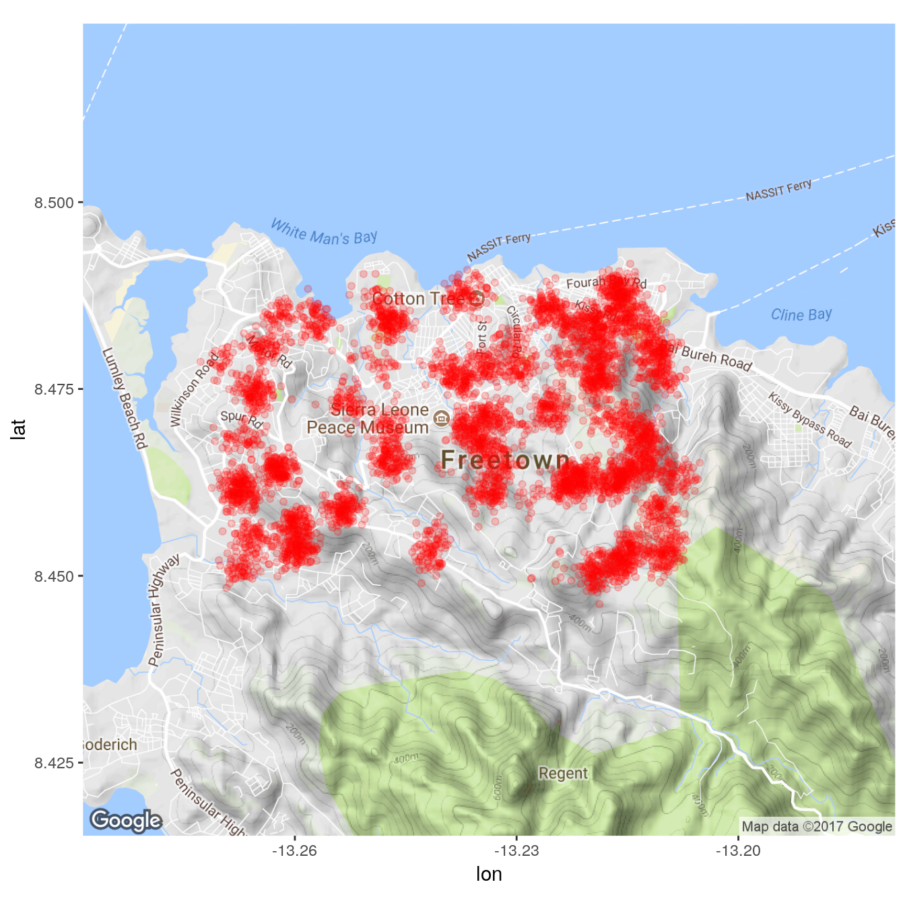

    library(outbreaks)
    library(ggmap)
    library(ggplot2)

Toy example: simulated Ebola outbreak in Freetown
-------------------------------------------------

This example uses the latest devel version of
[http://www.repidemicsconsortium.org/outbreaks/](*outbreaks*).

    head(ebola_sim$linelist)

    ##   case_id generation date_of_infection date_of_onset date_of_hospitalisation date_of_outcome
    ## 1  d1fafd          0              <NA>    2014-04-07              2014-04-17      2014-04-19
    ## 2  53371b          1        2014-04-09    2014-04-15              2014-04-20            <NA>
    ## 3  f5c3d8          1        2014-04-18    2014-04-21              2014-04-25      2014-04-30
    ## 4  6c286a          2              <NA>    2014-04-27              2014-04-27      2014-05-07
    ## 5  0f58c4          2        2014-04-22    2014-04-26              2014-04-29      2014-05-17
    ## 6  49731d          0        2014-03-19    2014-04-25              2014-05-02      2014-05-07
    ##   outcome gender           hospital       lon      lat
    ## 1    <NA>      f  Military Hospital -13.21799 8.473514
    ## 2    <NA>      m Connaught Hospital -13.21491 8.464927
    ## 3 Recover      f              other -13.22804 8.483356
    ## 4   Death      f               <NA> -13.23112 8.464776
    ## 5 Recover      f              other -13.21016 8.452143
    ## 6    <NA>      f               <NA> -13.23443 8.468572

    lonlat <- ebola_sim$linelist[, 10:11]
    head(lonlat)

    ##         lon      lat
    ## 1 -13.21799 8.473514
    ## 2 -13.21491 8.464927
    ## 3 -13.22804 8.483356
    ## 4 -13.23112 8.464776
    ## 5 -13.21016 8.452143
    ## 6 -13.23443 8.468572

    nrow(lonlat)

    ## [1] 5888

We assume latitude / longitude will be the standard way to indicate
locations. A basic map, using *ggmap* and *ggplot2*, would look like:

    base_points <- ggplot(data = lonlat, aes(x = lon, y = lat))
    base <- ggmap(get_map(lonlat, zoom = 13), base_layer = base_points)

    ## Map from URL : http://maps.googleapis.com/maps/api/staticmap?center=8.469638,-13.233806&zoom=13&size=640x640&scale=2&maptype=terrain&language=en-EN&sensor=false

    base + geom_point(col = "red", alpha = .2)

Adding kernel density estimation would also make sense here:

    base + geom_point(col = "red", alpha = .2) + geom_density_2d()

It would also make sense to aggregate data first. This is a bit less
trivial as there are several options for this:

-   use a clustering method based on lon/lat, and defining locations as
    geographic centres of the clusters

-   round up locations and use `xyTable`

We illustrate the latter, which may be more likely to reflect actual
situations where locations have low resolution (e.g. village, district
level, etc.).

    xy_rough <- data.frame(xyTable(lonlat, digits = 4))
    base + geom_point(data = xy_rough, aes(x = x, y = y, size = number),
                  col = "red", alpha = .5)

And here is the clustering version; we use *k* − *m**e**a**n**s* as it
is fairly quick and offers the nice feature of the underlying Voronoi
tesselation space partitioning:

    clust <- kmeans(lonlat, centers = 60)
    xy_clust <- data.frame(clust$centers, number = clust$size)
    base + geom_point(data = xy_clust, aes(x = lon, y = lat, size = number),
                  col = "red", alpha = .5)

